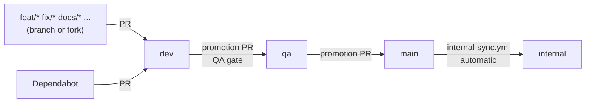

# Branch, PR and pipeline flow

How code moves through the Hyperion repository: where to branch from, where to send the PR, what each pipeline checks, and what to do when something fails. At the end, what of this reaches (and what does **not** reach) people using Hyperion in their own product.

**Português:** [fluxo-de-branches-e-pipeline.md](./fluxo-de-branches-e-pipeline.md) · Contribution rules: [CONTRIBUTING.md](../../../CONTRIBUTING.md)

---

## In 30 seconds

- You branch from **`dev`** and send the PR to **`dev`**.
- When a batch is ready, the maintainer promotes **`dev` → `qa`**, where the heavy sweep (QA gate) runs.
- Once QA passes, **`qa` → `main`**. `main` is what everyone gets from `git clone` or `hyperion:upgrade`, so it never carries a binding to this repository.
- **`internal`** pulls from `main` on its own and is where Hyperion uses itself (real board, real cards). It never sends anything back.



---

## The branches

| Branch | What it is | Accepts PRs from | Protection configured today |
|--------|------------|------------------|-----------------------------|
| `dev` | Integration. All work lands here first. | Any `feat/`, `fix/`, `docs/`, `chore/`, `refactor/`, `test/` branch (forks included) and Dependabot | Required check: `hyperion-validate` (Ubuntu + Windows). No force-push or deletion. |
| `qa` | Release candidate. | **Only `dev`** from this repository | Same as `dev`: only `hyperion-validate` is required. |
| `main` | The public version: what `git clone` and `hyperion:upgrade` deliver. Always clean. | **Only `qa`** | `hyperion-validate` required, and the PR branch must be up to date with `main`. Merges only through a PR, admins included. No force-push or deletion. |
| `internal` | Hyperion using Hyperion: linked board, real cards. | **Only `main`** (`internal-sync.yml` does it) | None: the branch is not protected. |

The "Accepts PRs from" column is the flow rule. `branch-flow` checks it on every PR into `qa`, `main` and `internal`, rejects anything out of order and says where to send it. For example, a PR from `feat/x` into `main` fails with "Merge it into 'dev' first; it reaches main through the dev → qa (QA release gate) → main promotion". A fork's `dev` branch is rejected in `qa` too: only this repository's `dev` promotes. Today, though, `branch-flow` is **not a required check**: a red result warns, it does not block the merge.

**Direct pushes:** only `main` blocks them (it requires a PR, admins included). On `dev` and `qa` a direct push is still technically possible; don't do it, open a PR.

**Recommended, not configured yet:**

- Make `branch-flow` required on `qa`, `main` and `internal`, and `qa-gate` required on `qa`.
- Require a PR to merge into `dev` and `qa`, as `main` already does.
- Protect `internal` (no force-push or deletion, merges only through a PR).

---

## Branch conduct

- **Name:** `<type>/<short-description>` with the Conventional Commits type: `feat/board-sprint-filter`, `fix/sync-duplicate-labels`, `docs/pipeline-flow`.
- **Always from an up-to-date `dev`:** `git fetch origin && git switch -c feat/my-change origin/dev`.
- **One topic per PR.** If you find another problem on the way, open another branch.
- **PR title in Conventional Commits** (`feat(cards): ...`, `fix(upgrade): ...`); the body follows the repository template.
- **New code in `scripts/` comes with tests.** The 95% line-coverage minimum (a file no test imports counts as 0%) is only enforced on the `dev` → `qa` promotion, not on your PR into `dev`. Run `npm run kit:coverage` first so the batch doesn't get stuck in QA because of your file.
- **No binding to this repository in commits:** GitHub Project number, real cards, plans in `.github/plans/`, personal paths. To test the sync against **your** board, set `PROJECT_NUMBER=<n>` in `.env`. The scripts read it and it never goes into Git. If the purity check flags something, `npm run hyperion:distribution-purity-check -- --fix` prints the plan of what it would clean (changing nothing); `-- --fix --yes` applies it, without deleting your files. `--fix` only runs inside the kit repository and refuses to run in any other repository.

---

## A PR's path (contributor)

1. Fork (or branch, if you have access) from `dev`.
2. Before opening the PR, run locally:
   ```bash
   npm test                                   # hyperion + cards tests
   npm run hyperion:distribution-purity-check # no binding to this repo
   npm run docs:check                         # links and translation pairs
   npm run skills:validate                    # if you touched skills
   npm run hyperion:check-rules               # if you touched commands.yml
   ```
3. Open the PR **into `dev`**. `hyperion-validate` runs on Ubuntu and Windows, and `hyperion-security` runs audit, licenses and secrets.
4. If something fails, open the **Checks** tab (or the annotations in **Files changed**). Failures from the kit's scripts say what broke, what to do and the command to reproduce it on your machine, pinned to the file when there is one. If there is no annotation, the cause is in the job log (see [When a pipeline fails](#when-a-pipeline-fails)).
5. Review and merge into `dev`. From here on it's the maintainer's job.

Fork PRs run **without secrets** and with a read-only token. Steps that need a token (real board sync, e2e) are skipped, and nothing leaks. First-time contributors need approval before workflows run.

---

## Promotion (maintainer)

### `dev` → `qa`

`gh pr create --base qa --head dev --title "chore(release): promote dev to qa"`

The PR triggers the **QA gate** (`qa-release-gate.yml`), too slow to run on every PR. It is the only place the 95% coverage is enforced:

| Job | What it guarantees |
|-----|--------------------|
| `tests` | `npm test` + kit tests on Ubuntu, Windows and macOS × Node 22 and 24 |
| `validation` | Every `hyperion-validate` check + **line coverage ≥ 95%** (`npm run kit:coverage`) |
| `install-and-upgrade` | Installs into a new product (`create-hyperion`) and upgrades a product on `main` to the candidate. The product's `project.yml` and workflows must stay byte-identical, and the upgrade must not create workflows. |
| `e2e-cards` | Forward and reverse sync against the sandbox repository (when configured) |
| `workflows-lint` | actionlint + shellcheck on the kit's workflows and product templates |
| `external-links` | External links in every `.md` |
| `secrets-history` | Verified secrets across the full history (trufflehog) |
| `docker` | Image build and smoke test |
| `qa-gate` | Aggregates everything and, on failure, names the jobs that broke. It is meant to be the required check on `qa`, but branch protection does not require it yet (see [The branches](#the-branches)). |

**Failed?** Don't fix it on `qa`. Fix it in a PR into `dev`; merging it updates the `dev` → `qa` PR and the gate runs again.

### `qa` → `main`

`gh pr create --base main --head qa --title "chore(release): promote qa to main"`. Merge once the checks are green.

### `main` → `internal`

Automatic. On every push to `main` (or a manual run), `internal-sync.yml` tries to merge `main` into `internal` through the API. It falls back to a `main` → `internal` PR, opened or reused, to merge by hand in two cases:

- the merge conflicts;
- `main` changed a file under `.github/workflows/`. `GITHUB_TOKEN` cannot push commits that touch workflows.

To make the second case merge on its own too, set the **`INTERNAL_SYNC_TOKEN`** secret: a fine-grained PAT with write access to Contents and Workflows on this repository. Without it the workflow uses `GITHUB_TOKEN` and every workflow change becomes a PR. The workflow only runs in the official repository (never in forks) and does nothing when there is no `internal` branch.

The `internal` binding to the real board lives only there: the `PROJECT_NUMBER` repository variable and workflows that only exist on that branch.

### Release

A `v*` tag on `main` (or a manual run) triggers `hyperion-docker-publish.yml`, which publishes the image.

---

## Every pipeline in this repository

| Workflow | When it runs | What it does |
|----------|--------------|--------------|
| `hyperion-validate.yml` | Push and PR on `dev`, `qa`, `main` | Purity (no binding), `project.yml`, docs (links, pairs, stale wording), skills, generated rules, cards, evals, catalog, `npm test`, dry-run sync — Ubuntu + Windows. The only required check today. |
| `hyperion-security.yml` | PR on `dev`, `qa`, `main` + every Monday + manual | `npm audit`, licenses, secrets |
| `hyperion-product-ci.yml` | Push and PR on `main` | The product CI template running on the kit itself: detects the stack and runs install, lint, test and build |
| `branch-flow.yml` | PR on `qa`, `main`, `internal` | The PR comes from the right branch |
| `qa-release-gate.yml` | PR on `qa` + manual | The sweep described above |
| `internal-sync.yml` | Push on `main` + manual | Brings `main` into `internal` (with a fallback PR; see above) |
| `hyperion-docker-publish.yml` | `v*` tag + manual | Publishes the Docker image |
| `hyperion-e2e-cards.yml` | Manual | Sync e2e against the sandbox |
| `hyperion-sync-cards.yml` | Manual | The card sync a product would use; here it has no push trigger because `main` has no board |
| `hyperion-cards-pr-check.yml` | PR into `main` touching `.github/cards/` or `scripts/cards-sync/` (+ merge queue) | Board drift guard; fork PRs only validate the cards |
| `hyperion-cards-pr-recheck.yml` | Every 30 min + `hyperion-board-changed` event + manual | Re-checks open PRs into `main` |

### 95% coverage

Runs only in the QA gate (the `validation` job of the `dev` → `qa` PR); PRs into `dev` don't check it. `npm run kit:coverage` runs the suite with Node's coverage and adds **every** file in `scripts/hyperion`, `scripts/cards-sync` and `scripts/kit` that no test imports, counting all its lines as uncovered. That way an untested script can't drop out of the count. The output lists the files with the most uncovered lines and how many lines are missing to reach 95%. The live e2e scripts are excluded because they are tests themselves.

This is exclusive to this repository: `scripts/kit/` and the `kit:*` scripts never reach products.

### When a pipeline fails

The kit's scripts (validations, docs, skills, cards, coverage, `branch-flow`) and the QA gate steps written for it emit a GitHub annotation with a title, the reason, what to do and the command to reproduce it locally, pinned to the file when there is one. Examples:

- `Broken doc link` on `docs/x.md`: "Link target not found: ./y.md".
- `PR into main must come from qa`: tells you to send the PR to `dev`.
- `Kit coverage below 95%`: says how many lines are missing and which files to start with.

Not every failure becomes an annotation: install errors (`npm ci`), third-party tools (`npm audit`, actionlint, trufflehog, the external link check, the Docker build) and shell steps without their own handling only show `Process completed with exit code 1`. In those cases the cause is in the job log.

---

## In your product (Hyperion users)

None of the above goes into your repository: the 95% gate, `branch-flow`, the QA gate and the kit's workflows belong to the Hyperion repository. `hyperion:upgrade` **does not copy workflows**.

Your product's pipelines come from `/pipeline` (`npm run hyperion:pipeline-apply`), based on `ci.gates` in your `project.yml`:

| Workflow | When it runs | What it does |
|----------|--------------|--------------|
| `hyperion-product-ci.yml` | Push and PR on the default branch | The gates you chose: lint, format, typecheck, tests, coverage, build, audit... |
| `hyperion-sync-cards.yml` | Push on the default branch touching `.github/cards/` or `scripts/cards-sync/` + manual | Pulls the board → checks for drift → pushes the cards → checks again |
| `hyperion-cards-pr-check.yml` | PR into the default branch touching `.github/cards/` or `scripts/cards-sync/` (+ merge queue) | Flags when the board changed outside and the branch doesn't have that change. It only blocks the merge if you mark the check as required in branch protection. |
| `hyperion-cards-pr-recheck.yml` | Every 30 min + `hyperion-board-changed` event + manual | Re-checks open PRs when the board changes |
| `hyperion-security.yml` | PR + every Monday + manual | Audit, licenses and secrets (optional) |
| `hyperion-validate.yml` | Push and PR on the default branch | Hyperion's validations in your repository (optional: `ci.hyperion.kit_validation: true`) |

To update after a kit upgrade:

```bash
npm run hyperion:pipeline-apply -- --refresh-sync --yes    # card pipelines
npm run hyperion:pipeline-apply -- --refresh-gates --yes   # product CI, after changing ci.gates
```

Already have your own CI (GitLab, Azure or a mature `ci.yml`)? See [pipeline-merge-en.md](../integration/pipeline-merge-en.md).
