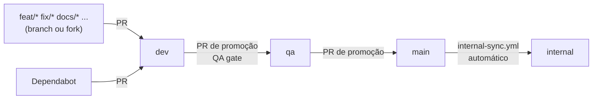

# Fluxo de branches, PRs e pipeline

Como o código anda dentro do repositório do Hyperion — de onde abrir a branch, para onde mandar o PR, o que cada pipe verifica e o que fazer quando algo falha. No fim, o que disso chega (e o que **não** chega) a quem usa o Hyperion no próprio produto.

**English:** [branch-and-pipeline-flow-en.md](./branch-and-pipeline-flow-en.md) · Regras de contribuição: [CONTRIBUTING.md](../../../CONTRIBUTING.md)

---

## Em 30 segundos

- Você abre a branch a partir de **`dev`** e manda o PR para **`dev`**.
- Quando um lote está pronto, o mantenedor promove **`dev` → `qa`**. Ali roda a varredura pesada (QA gate).
- Passou no QA, promove **`qa` → `main`**. A `main` é o que todo mundo baixa com `git clone` ou `hyperion:upgrade`, então ela nunca tem vínculo com este repositório.
- A **`internal`** puxa da `main` sozinha e é onde o Hyperion usa ele mesmo (board real, cards reais). Ela nunca manda nada de volta.



---

## As branches

| Branch | O que é | Aceita PR de | Checks obrigatórios |
|--------|---------|--------------|---------------------|
| `dev` | Integração. Todo trabalho entra aqui primeiro. | Qualquer branch `feat/`, `fix/`, `docs/`, `chore/`, `refactor/`, `test/` (inclusive de fork) e o Dependabot | `hyperion-validate` (Ubuntu + Windows) |
| `qa` | Release candidate. | **Só `dev`**, deste repositório | `hyperion-validate`, `branch-flow`, `qa-gate` |
| `main` | A versão pública: o que `git clone` e `hyperion:upgrade` entregam. Sempre limpa. | **Só `qa`** | `hyperion-validate`, `branch-flow` |
| `internal` | O Hyperion usando o próprio Hyperion: board vinculado, cards reais. | **Só `main`** (o `internal-sync.yml` faz sozinho) | — |

O `branch-flow` recusa qualquer PR fora dessa ordem e diz para onde mandar. Exemplo: um PR de `feat/x` para `main` falha com "Merge it into 'dev' first; it reaches main through the dev → qa (QA release gate) → main promotion". Uma branch `dev` de fork também é recusada em `qa`, porque só a `dev` deste repositório promove.

Ninguém faz push direto em `dev`, `qa` ou `main`.

---

## Conduta de branch

- **Nome:** `<tipo>/<descrição-curta>`, com o tipo do Conventional Commits: `feat/board-filtro-sprint`, `fix/sync-labels-duplicadas`, `docs/fluxo-pipeline`.
- **Sempre a partir da `dev` atualizada:** `git fetch origin && git switch -c feat/minha-mudanca origin/dev`.
- **Um assunto por PR.** Se aparecer outro problema no caminho, abra outra branch.
- **Título do PR em Conventional Commits** (`feat(cards): ...`, `fix(upgrade): ...`); o corpo segue o template do repositório.
- **Código novo em `scripts/` vem com teste.** O QA exige 95% das linhas cobertas, e um arquivo que nenhum teste importa conta como 0%.
- **Nada de vínculo com este repositório no commit:** número de GitHub Project, cards reais, planos em `.github/plans/`, caminhos pessoais. Para testar o sync contra o **seu** board, use `PROJECT_NUMBER=<n>` no `.env`. Ele é lido pelos scripts e nunca vai para o Git. Se o check de pureza acusar algo, `npm run hyperion:distribution-purity-check -- --fix` limpa sem apagar seus arquivos.

---

## O caminho de um PR (contribuidor)

1. Fork (ou branch, se você tem acesso) a partir de `dev`.
2. Antes de abrir o PR, rode localmente:
   ```bash
   npm test                                   # testes do hyperion + cards
   npm run hyperion:distribution-purity-check # nenhum vínculo com este repo
   npm run docs:check                         # links e pares de tradução
   npm run skills:validate                    # se mexeu em skills
   npm run hyperion:check-rules               # se mexeu em commands.yml
   ```
3. Abra o PR **para `dev`**. O `hyperion-validate` roda em Ubuntu e Windows, e o `hyperion-security` faz auditoria, licenças e segredos.
4. Se algo falhar, abra a aba **Checks** (ou veja as anotações em **Files changed**). Cada falha diz o que quebrou, o que fazer e o comando para reproduzir na sua máquina, apontando o arquivo quando dá.
5. Review e merge na `dev`. Daqui em diante é com o mantenedor.

PRs de fork rodam **sem segredos** e com token só de leitura. Os passos que precisam de token (sync real com o board, e2e) são pulados, sem vazar nada. Quem contribui pela primeira vez precisa de aprovação para os workflows rodarem.

---

## Promoção (mantenedor)

### `dev` → `qa`

`gh pr create --base qa --head dev --title "chore(release): promote dev to qa"`

O PR dispara o **QA gate** (`qa-release-gate.yml`), lento demais para rodar em todo PR:

| Job | O que garante |
|-----|---------------|
| `tests` | `npm test` + testes do kit em Ubuntu, Windows e macOS × Node 22 e 24 |
| `validation` | Todas as validações do `hyperion-validate` + **cobertura ≥ 95% das linhas** (`npm run kit:coverage`) |
| `install-and-upgrade` | Instala num produto novo (`create-hyperion`) e atualiza um produto que está na `main` para o candidato. O `project.yml` e os workflows do produto têm que ficar idênticos byte a byte, e o upgrade não pode criar workflow. |
| `e2e-cards` | Sync de ida e volta contra o repositório sandbox (quando configurado) |
| `workflows-lint` | actionlint + shellcheck nos workflows do kit e nos templates de produto |
| `external-links` | Links externos de todo `.md` |
| `secrets-history` | Segredos verificados no histórico inteiro (trufflehog) |
| `docker` | Build e smoke test da imagem |
| `qa-gate` | Junta tudo; é o check obrigatório. Se falhar, diz quais jobs quebraram. |

**Falhou?** Não se corrige na `qa`. Corrija num PR para `dev`. Ao mergear, o PR `dev` → `qa` é atualizado e o gate roda de novo.

### `qa` → `main`

`gh pr create --base main --head qa --title "chore(release): promote qa to main"`. Com os checks verdes, merge.

### `main` → `internal`

Automático. A cada push na `main`, o `internal-sync.yml` tenta mesclar a `main` na `internal`. Se houver conflito, ele abre (ou reaproveita) um PR `main` → `internal` para resolver à mão. O vínculo da `internal` com o board real fica só nela: a variável do repositório `PROJECT_NUMBER` e os workflows que só existem lá.

### Release

Uma tag `v*` na `main` dispara o `hyperion-docker-publish.yml`, que publica a imagem.

---

## Todas as pipes do repositório

| Workflow | Quando roda | O que faz |
|----------|-------------|-----------|
| `hyperion-validate.yml` | Push e PR em `dev`, `qa`, `main` | Pureza (sem vínculo), `project.yml`, docs (links, pares, texto desatualizado), skills, regras geradas, cards, evals, catálogo, `npm test`, sync em dry-run — Ubuntu + Windows |
| `hyperion-security.yml` | PR em `dev`, `qa`, `main` + toda segunda | `npm audit`, licenças, segredos |
| `branch-flow.yml` | PR em `qa`, `main`, `internal` | A origem do PR é a branch certa |
| `qa-release-gate.yml` | PR em `qa` | A varredura descrita acima |
| `internal-sync.yml` | Push em `main` | Leva a `main` para a `internal` |
| `hyperion-docker-publish.yml` | Tag `v*` | Publica a imagem Docker |
| `hyperion-e2e-cards.yml` | Manual | e2e do sync contra o sandbox |
| `hyperion-sync-cards.yml`, `hyperion-cards-pr-check.yml`, `hyperion-cards-pr-recheck.yml` | Manual / PR que mexe em cards / a cada 30 min | As pipes de cards que um produto usaria; aqui o sync não tem gatilho de push, porque a `main` não tem board |

### Cobertura de 95%

`npm run kit:coverage` roda a suíte com cobertura do Node e soma **todo** arquivo de `scripts/hyperion`, `scripts/cards-sync` e `scripts/kit` que nenhum teste importa, contando todas as linhas dele como descobertas. Assim um script sem teste não some da conta. A saída lista os arquivos com mais linhas descobertas e quantas faltam para 95%. Os scripts de e2e ao vivo ficam fora, porque já são testes.

Isso é exclusivo deste repositório: `scripts/kit/` e os scripts `kit:*` não vão para produtos.

### Quando uma pipe falha

Toda falha vira uma anotação do GitHub com título, motivo, o que fazer e o comando para reproduzir localmente, presa ao arquivo quando existe um. Exemplos:

- `Broken doc link` em `docs/x.md`: "Link target not found: ./y.md".
- `PR into main must come from qa`: diz para mandar o PR para `dev`.
- `Kit coverage below 95%`: diz quantas linhas faltam e por quais arquivos começar.

---

## No seu produto (quem usa o Hyperion)

Nada do que está acima vai para o seu repositório: o gate de 95%, o `branch-flow`, o QA gate e os workflows do kit são do repositório do Hyperion. O `hyperion:upgrade` **não copia workflows**.

As pipes do seu produto vêm do `/pipeline` (`npm run hyperion:pipeline-apply`), a partir do `ci.gates` do seu `project.yml`:

| Workflow | Quando roda | O que faz |
|----------|-------------|-----------|
| `hyperion-product-ci.yml` | Push e PR na branch principal | Os gates que você escolheu: lint, format, typecheck, testes, cobertura, build, audit... |
| `hyperion-sync-cards.yml` | Push na branch principal | Puxa o board → confere divergência → envia os cards → confere de novo |
| `hyperion-cards-pr-check.yml` | PR que mexe em `.github/cards/` | Bloqueia o merge se o board mudou por fora e a branch não tem essa mudança |
| `hyperion-cards-pr-recheck.yml` | A cada 30 min | Reconfere PRs abertos quando o board muda |
| `hyperion-security.yml` | PR + semanal | Auditoria e segredos (opcional) |

Para atualizar depois de um upgrade do kit:

```bash
npm run hyperion:pipeline-apply -- --refresh-sync --yes    # pipes de cards
npm run hyperion:pipeline-apply -- --refresh-gates --yes   # CI do produto, depois de mudar ci.gates
```

Já tem CI próprio (GitLab, Azure ou um `ci.yml` maduro)? Veja [pipeline-merge.md](../integration/pipeline-merge.md).
